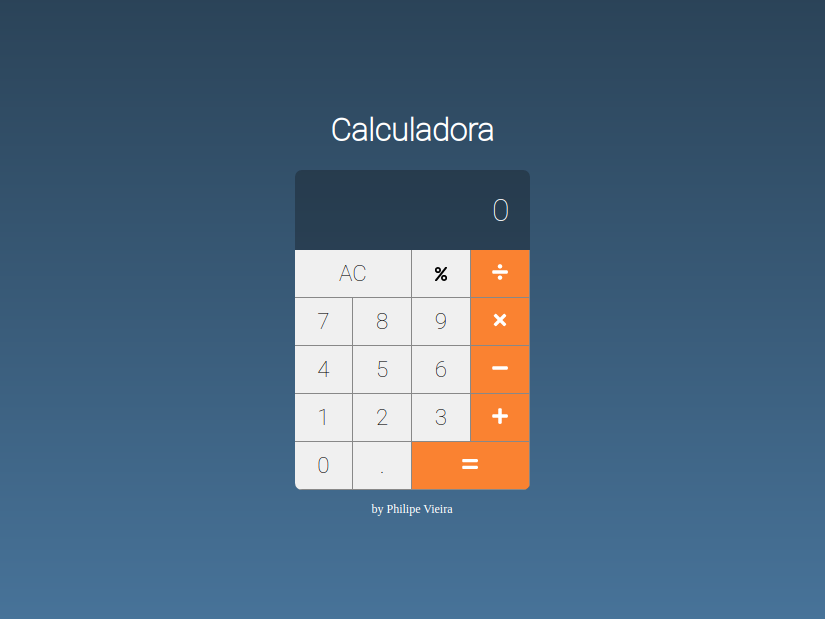

# CalculadoraReact


> _This project was created based on the [Calculator](https://github.com/cod3rcursos/curso-react-redux/tree/master/novos-projetos/calculadora) Project developed in the React + Redux course of **[Cod3r - Cursos Online de Tecnologia](https://www.cod3r.com.br/)**. But with **several changes** and **improvements** in functionalities._

CalculadoraReact is an application developed only with the ReactJS library. Created in order to practice and learn about frontend development with the library.

This project Includes only three small, simple components, with minimal complex and maximum functionality working correctly. but it also includes the functionality of the percentage calculation, and drastic changes to the [setOperation](https://github.com/philipe-vieira/CalculadoraReact/blob/master/src/components/Calculator/index.jsx?#L42) function.


### How to run application in environment local

Before of running the project, you need to install the [nodeJS](https://nodejs.org/en/).

#### Clone or download the repository

Command to clone:

```bash
~$ git clone https://github.com/philipe-vieira/CalculadoraReact.git
```

Or if you prefer [download](https://github.com/philipe-vieira/CalculadoraReact/archive/master.zip) the archive .zip

#### Running application

Open your prefer command line interface and run the following command:

```bash
~$ npm run start
```

Or if you use yarn:

```bash
~$ yarn start
```

#### Open application

If your application does not automatically open a browser tab, you can open [http://localhost:3000](http://localhost:3000) manually in your browser.

### Learn More

You can learn more in the [Create React App documentation](https://facebook.github.io/create-react-app/docs/getting-started) and/or [ReactJS official documentation](https://reactjs.org/).
